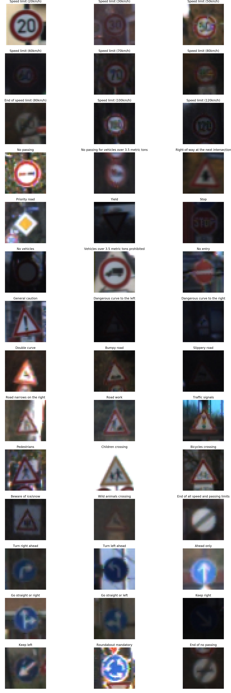
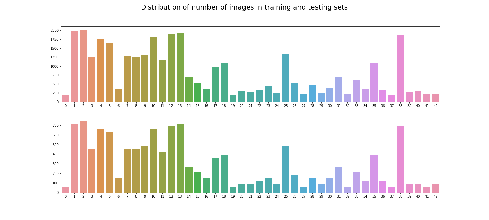
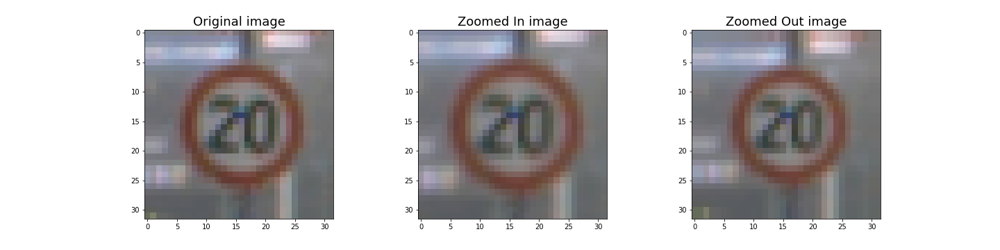
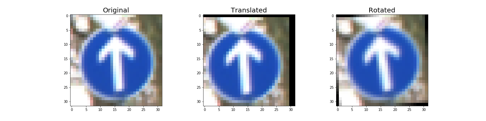
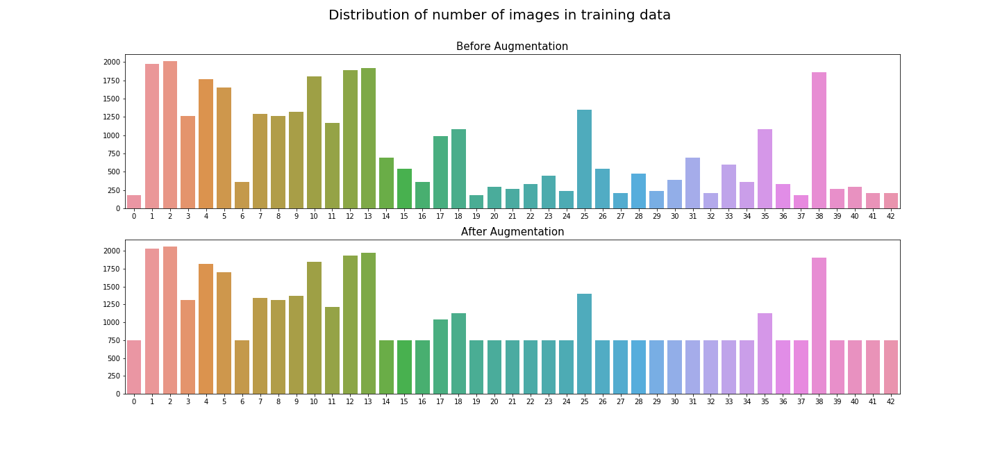
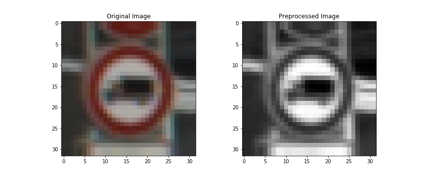
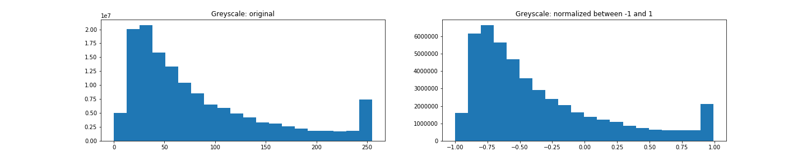
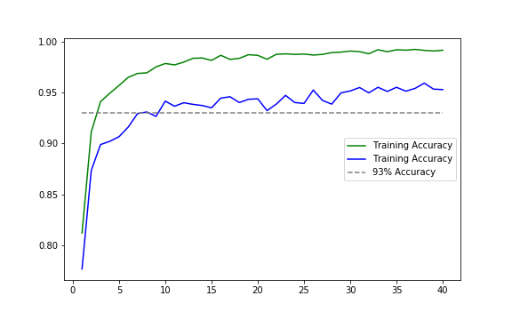
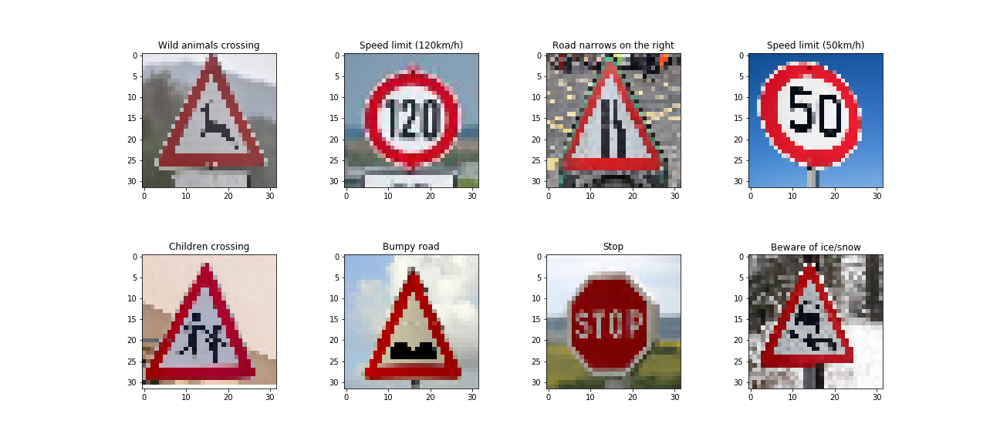

# Traffic Sign Classifier

The goal is to build a deep learning model that correctly classifies a set of images of traffic signs.

## Dataset Summary

Three labeled datasets are provided - one for building and training an image classification model for traffic signs, one for validation and one for testing.

- All the individual images are of size (32, 32, 3)
- There are 43 image classes (labels)
- The training set has 34,799 images
- The validation set has 4,410 images
- The testing set has 12,630 images


## Exploratory Visualization

Let's take a look at some of the images  -




## Data Augmentation
Let us take a look at the number of images for each class in the training and the testing datasets. &nbsp;




Clearly, some traffic signs have fewer images in the datasets than others. This is a well known problem in classification called the **class imbalance problem** - this leads to poor classification performance as the model does not learn enough from the low-frequency classes. To mitigate this, I augmented the training dataset with new labelled images. I generated these images using the following computer vision techniques.

### Zoom In and  Zoom Out

For a given training image, I create a new image by zooming in on and zooming out of the image slightly. I created two functions `zoom_in_image` and `zoom_out_image` to implement these tasks. The magnitude of zooming in or out is chosen randomly by generating random numbers from a Gaussian distribution and then using the `cv2.resize()` function. In order to make the new image of dimesions `32X32`, I used the `cv2.copyMakeBorder`function to fill out the borders of the image.

Here is a set of examples - 



### Translation and Rotation

For a given training image, translation shifts the image on both X and Y directions. It is acheieved by adding(or subtracting) two Gaussian random numbers to the height and width of the image and warping the image slightly to the new dimensions. Rotation on the other hand rotates the image a little bit. It is done by creating a rotation matrix based on the center of a given image and a random angle drawn from a Gaussian distribution. I wrote two functions `translate_image` and `rotate_image` to implement these two techniques.

Here is a set of examples- 


### Generating New Training Images for Every Image Class

I decided for all the 43 image categories I will generate new training images. If an image category had less than 750 samples in the training data, then I generated just an many images as to bring the sample count to 750. Otherwise, for image categories with more than 750 samples in the training data, I generated 50 more.

To choose between the four image augmentation methods described above, I wrote a function `augment_training_data` to randomly choose between the four methods increase the counts of all the image categories to at least 750.

```python
def augment_training_data(X_data, y_data):
    assert len(X_data) == len(y_data), "X and y data have different lengths"
    X_out, y_out = X_data, y_data
    y_categories, y_counts = np.unique(y_data, return_counts = True)
    max_count = max(y_counts)
    for i in y_categories:
        if y_counts[i] <= 750:
            N = 750 - y_counts[i]
        else:
            N = 50
            
        start_time = time.time()
        cat_indices = np.where(y_data == i)[0]
        for j in range(N):
            random_index = np.random.choice(cat_indices)
            transformation = np.random.choice(['first', 'second', 'third', 'fourth'], 1, 
                                              p = [0.25, 0.25, 0.25, 0.25])
            if transformation == 'first':
                X_out = np.concatenate((X_out, [zoom_in_image(X_data[random_index])]), axis = 0)
            elif transformation == 'second':
                X_out = np.concatenate((X_out, [zoom_out_image(X_data[random_index])]), axis = 0)
            elif transformation == 'third':
                X_out = np.concatenate((X_out, [translate_image(X_data[random_index])]), axis = 0)
            elif transformation == 'fourth':
                X_out = np.concatenate((X_out, [rotate_image(X_data[random_index])]), axis = 0)

            y_out = np.concatenate((y_out, [i]))
        end_time = time.time()
        print('time taken for image number %d = ' %i, (end_time - start_time)//60, ' minutes and ', 
              round((end_time - start_time)%60, 2), ' seconds')
    return X_out, y_out

X_train_augmented, y_train_augmented = augment_training_data(X_train, y_train)
```
**Before the image augmentation step, the training data had 34,799 images. After the augmentation, it has 46,030 images.**



## Preprocessing

The given images are colored images of the size (32, 32, 3) where 3 is the number of color channels. I convert the images to greyscale by taking the average of the 3 channels. So the greyscale images are of the size (32, 32, 1).

Also, I normalize the images from the range [0, 256] to [-1, 1]. 

The preprocessing is done by implementing the function pre_process_features, which takes an input dataframe of colored images and outputs a dataframe of grayscale images after normalizing the pixel values between -1 and 1.

```python
def pre_process_features(input_df):
    '''
    preprocess input data
    '''
    # convert to grayscale
    out_df = np.mean(input_df, axis=3, keepdims=True)
    # normalize between -1 and 1
    out_df = (out_df - 128)/128
    return out_df
```

Let us take a look at an image before and after preprocessing.



Just to make sure that the normalization has not changed the distribution of the data after grayscaling, I plotted the the historgams of the data before and after normalization. 

From the plots it can be seen that they are the same, which means that though the range has changed from [0, 256] to [-1, 1], the relative information in the data for classification has remained the same. 


## Model Architecture (Modified LeNet-5)

I modified the LeNet-5 architecture to train a model to classify the traffic signs correctly. The following table describes the different layers of the architecture.

|Layer|Description|
|---|---|
|Input|32x32x1 Greyscale Image, Normalized between [-1, 1]|
|Convolution 5x5|16 filters, strides of 1, valid padding; Output size = 28x28x16|
|ReLU|Activation function|
|Max Pooling|2x2 filter, strides of 2, valid padding; Output size = 14x14x16|
|Convolution 5x5|32 filters, strides of 1, valid padding; Output size = 10x10x32|
|ReLU|Activation function|
|Max Pooling|2x2 filter, strides of 2, valid padding; Output size = 5x5x32|
|Flattened Layer|Output vector size = 1x800|
|Fully Connected Layer|Layer size = 160|
|ReLU|Activation function|
|Dropout|dropout rate = 0.50|
|Fully Connected Layer|Layer size = 60|
|ReLU|Activation function|
|Final layer - fully connected|Layer size = 43|
|Softmax layer|Probabilities for each of the 43 image classes, Layer size = 43|

## Model Training

I chose a learning rate of 0.001 and the Adam optimizer in TensorFlow. I ran 40 epochs with a batch size of 64 and the model was optimized on the cross-entropy loss function.

## Solution Approach

For every epoch, the training data was randomly shuffled and training batches of size 64 was passed through the model to optimize the corss-entropy loss function. 

The following plot shows the progress accuracy for the training and the validation sets. 



At the end of the 40 epochs, the training accuracy was 99.1% and validation accuary was 95.3%.

Also, when the testing data was passed through the trained model, an accuract of 93.1% was achieved.

## Testing the Model on New Images

### Acquiring New Images

I downloaded new images of German traffic signs from the internet and cropped and resized them to get images of size 32x32.



### Accuracy on New Images
I got 50% accuracy on these images.